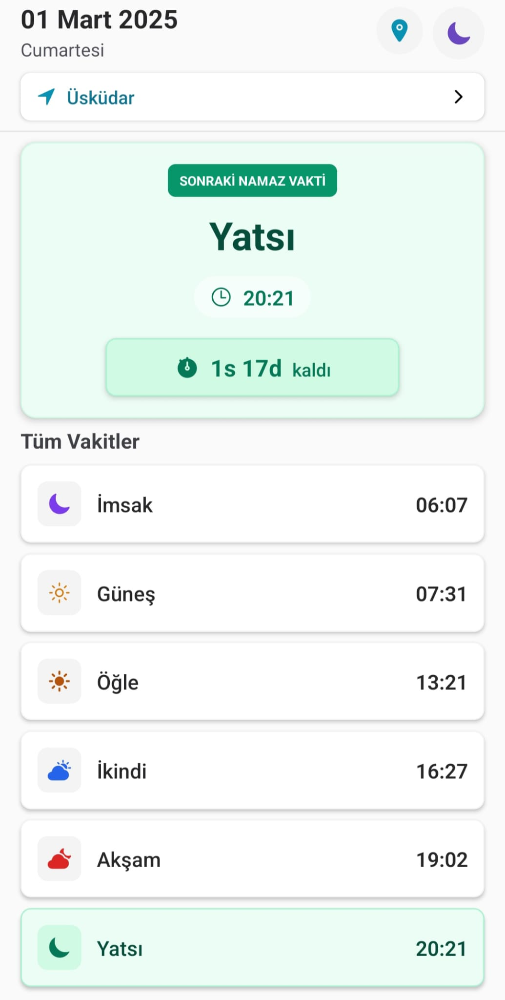
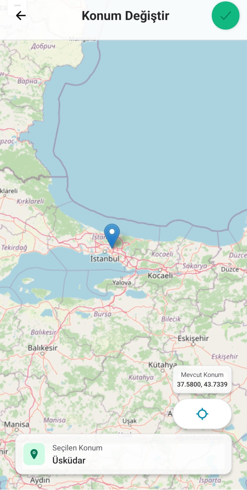

# Vakitname

Bu proje, [Aladhan Prayer Times API](https://aladhan.com/prayer-times-api) kullanılarak ve React Native Expo ile oluşturulmuş bir namaz vakti uygulamasıdır. VS Code agent kullanılarak geliştirilmiştir.

## Kullanım

1. Depoyu klonlayın:
   ```sh
   git clone <repo-url>
   cd Vakitname
   ```
2. Bağımlılıkları yükleyin:
   ```sh
   npm install
   ```
3. Expo geliştirme sunucusunu çalıştırın:
   ```sh
   expo start
   ```
   Uygulamayı Expo Go ile test etmek için QR kodunu tarayabilirsiniz.

## API

Bu proje, namaz vakitlerini almak için [Aladhan](https://aladhan.com/prayer-times-api) tarafından sağlanan API'yi kullanmaktadır. Kendilerine teşekkür ederiz!

## Görseller

Projeden bazı ekran görüntüler:

<div style="display: flex; gap: 10px;">
  
  
</div> 
